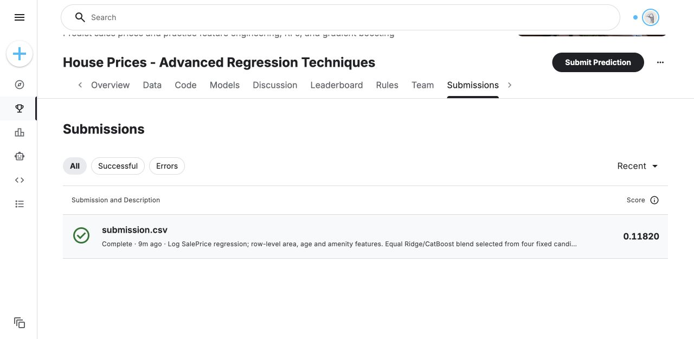

# House Prices

Predict residential sale prices in Ames, Iowa, for [House Prices — Advanced Regression Techniques](https://www.kaggle.com/competitions/house-prices-advanced-regression-techniques).
The official data contains 1,460 training houses, 1,459 test houses and 79 original predictors.
The evaluation metric is RMSE between natural-log predicted and observed prices; lower is better.

## Method

1. Train on `log(SalePrice)` and convert predictions back with `exp`.
2. Keep all training rows and exclude `Id` from the predictors.
3. Add house age, years since remodeling, total floor area, total bathroom count, total porch/deck area and presence indicators for a garage, basement, second floor and fireplace.
4. Apply fixed `log1p` transforms to area and other nonnegative size/value features. Treat building class and sale month as categorical values.
5. Compare Ridge, Elastic Net, CatBoost and a fixed 50/50 Ridge/CatBoost blend using identical five-fold splits.
6. Select the lowest pooled out-of-fold log RMSE before observing a new Kaggle score. Check a sale-year diagnostic, then average the selected fold models' predictions in log space.

Features are derived independently from each house's row.
Missing categories become `Missing`. For linear models, median imputation, missing-value indicators, numeric scaling and one-hot encoding are fitted inside each training fold.
CatBoost uses categorical features directly and handles missing numeric values natively.
The blend averages log predictions, so its price prediction is a geometric blend rather than an arithmetic price average.

Ridge uses `alpha=20`. Elastic Net uses `alpha=0.0007` and `l1_ratio=0.8`.
CatBoost uses 1,500 iterations, depth 5, learning rate 0.035 and L2 regularization 8, with two CPU threads.
The parameters and blend weights are fixed; no leaderboard feedback is used to adjust them.

## Validation results

Five-fold shuffled cross-validation uses seed 42 and retains all 1,460 training rows.

| Model | OOF log RMSE |
| --- | --- |
| Mean log-price baseline | 0.39958 |
| Ridge | 0.13166 |
| Elastic Net | 0.12765 |
| CatBoost | 0.12725 |
| **50/50 Ridge + CatBoost** | **0.12544** |

The selected blend's fold scores range from 0.10519 to 0.15887.
A temporal diagnostic trains on 947 houses sold in 2006–2008 and validates on 513 houses sold in 2009–2010.
Its log RMSE is **0.12699**, compared with 0.41589 for the mean log-price baseline.

Cross-validation is reused for candidate selection, so the selected score can be optimistic.
The temporal split is a diagnostic rather than an independent holdout: these labels also appeared in the cross-validation comparison.
OOF validation evaluates the fold-model recipe; the final five-fold inference ensemble is not separately validated by nested cross-validation.
These data describe one historical US housing market and do not establish performance for current Japanese properties.

## Kaggle result

The selected 50/50 Ridge/CatBoost blend was submitted on 2026-10-05 and achieved an official score of **0.11820**.
This is a competition test-set score, distinct from the local CV score of 0.12544 and the temporal diagnostic score of 0.12699.
No further model or weight selection uses this score.

## Reproduction

Install the repository's dependencies, then download the official files from the [competition data page](https://www.kaggle.com/competitions/house-prices-advanced-regression-techniques/data).
Place `train.csv`, `test.csv`, `sample_submission.csv` and `data_description.txt` in `house-prices/data/`.

```sh
pip install -r requirements.txt
python house-prices/train.py --data-dir house-prices/data --output-dir house-prices/artifacts
```

The script writes `submission.csv` and `metrics.json`.
It verifies 1,459 unique test IDs in the original order, the exact `Id,SalePrice` schema and finite positive prices.
The recorded local environment is Python 3.12.14, NumPy 2.3.5, pandas 2.2.3, scikit-learn 1.7.2 and CatBoost 1.2.8.
The submitted file's hash and actual Kaggle score are recorded separately from local validation.

To rebuild the standalone notebook:

```sh
python scripts/build_house_prices_notebook.py
```

On Kaggle, attach the official House Prices competition input and run [solution.ipynb](solution.ipynb) on CPU.
The [Kaggle notebook](https://www.kaggle.com/code/mvfrsshiga/house-prices-log-price-regression) includes a completed CPU run of the solution.
The script supports both direct competition mounts and `/kaggle/input/competitions/` mounts.
Different package versions can change model selection or predictions; the submitted prediction file is generated with the recorded local versions.

- [Training and prediction code](train.py)
- [Measured validation, parameters and package versions](results/metrics.json)
- [Official submission result and prediction hash](results/submissions.json)



Only official training labels are used. Raw competition files and fitted models are excluded from this repository.
