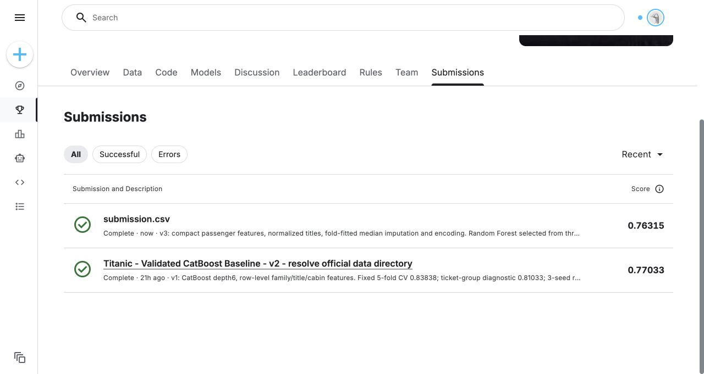

# Titanic

Survival prediction for [Titanic — Machine Learning from Disaster](https://www.kaggle.com/competitions/titanic), evaluated by accuracy.
The official dataset contains 891 training passengers and 418 test passengers.

## Features and models

Features include sex, passenger class, age, fare, family counts and embarkation port, along with family size, traveling alone, fare per person, title, name length, cabin deck and ticket prefix.
Features are derived from each passenger's row. Missing numeric values are filled with `-1`; missing categorical values are filled with `Unknown`.

CatBoost depths 4, 5 and 6 were compared using five-fold stratified cross-validation (seed=42). Depth 6 achieved the highest accuracy and was selected.
Log loss breaks accuracy ties. Five-fold ticket-group cross-validation also evaluates the selected model, keeping passengers with the same ticket in the same fold.
Three models are fitted on the full training data with seeds 42, 137 and 2026. Their probabilities are averaged and classified at a threshold of 0.5.

A second comparison removed name length and evaluated CatBoost with stronger regularization, Random Forest and Extra Trees.
Random Forest and Extra Trees use one-hot encoding for categorical features, 400 trees, a maximum depth of 7 and a minimum of 3 samples per leaf.

A third comparison uses 14 compact features and compares Logistic Regression, shallow Gradient Boosting and Random Forest with fixed parameters.
Titles `Mlle` and `Ms` become `Miss`; `Mme` becomes `Mrs`. Titles other than `Mr`, `Mrs`, `Miss` and `Master` become `Rare`.
Family size is grouped as alone, small (2–4) or large (5 or more). Fare and fare per family member use `log1p`.
Name length, ticket prefix and cabin count are omitted. Passenger class is categorical, and missing numeric values use median imputation.
Imputation, scaling and one-hot encoding are fitted only on each training fold.

The compact Random Forest uses 400 trees, a maximum depth of 6, a minimum of 4 samples per leaf and `max_features=0.8`.
The candidate with the highest mean accuracy across the two CV schemes is selected, with mean log loss breaking ties.
The selected model and the original CatBoost are then evaluated as three-seed ensembles using seeds 42, 137 and 2026 in every fold.
This evaluates the same averaging procedure used for the final submission.
Because the representation, preprocessing and model settings all change together, this experiment does not isolate the effect of title normalization alone.

## Results

| Model | Stratified CV | Ticket-group CV | Kaggle Public score |
| --- | --- | --- | --- |
| CatBoost depth 6 | 83.84% | 81.03% | **0.77033** |
| CatBoost (stronger regularization) | 83.50% | 81.03% | Not submitted |
| Random Forest | 83.84% | 81.48% | Not submitted |
| Extra Trees | 81.93% | 80.02% | Not submitted |
| Random Forest, compact features, three-seed ensemble | 84.18% | 82.49% | **0.76315** |

The CatBoost model was submitted on 2026-10-04.
Random Forest improved mean accuracy across the two CV schemes by 0.224 percentage points and ticket-group CV accuracy by 0.449 percentage points.
It did not meet the submission criteria of at least 0.2 percentage points improvement in mean CV and 0.5 percentage points in ticket-group CV, so its Kaggle score has not been measured.

The compact Random Forest was submitted on 2026-10-05 after meeting the same improvement thresholds against both the historical v1 CV and a fresh evaluation of the v1 ensemble in the local environment.
Its Public score was 0.76315, below the original CatBoost score of 0.77033. The original submission remains the best measured result.

The third comparison's candidate scores use one model per fold:

| Compact-feature candidate | Stratified CV | Ticket-group CV | Mean accuracy |
| --- | --- | --- | --- |
| Logistic Regression | 83.61% | 81.93% | 82.77% |
| Gradient Boosting | 83.05% | 81.82% | 82.44% |
| Random Forest | 84.40% | 82.60% | 83.50% |

When evaluated as three-seed ensembles in the same environment, CatBoost achieved 84.18% stratified CV and 81.14% ticket-group CV; compact Random Forest achieved 84.18% and 82.49%.
The paired ticket-group accuracy difference was +1.35 percentage points. Resampling complete tickets 2,000 times gave a 95% interval of approximately −0.23 to +3.10 percentage points.
This interval includes zero and excludes training and model-selection uncertainty, so the CV improvement is not strong evidence of a reliable generalization gain.

Candidate selection reuses the same CV folds, which can make the best CV score optimistic. Ticket-group CV is not an independent holdout.
The historical first and second comparisons use single-model CV; the third comparison separately evaluates the three-seed ensemble procedure.
Its worse Public score shows that selecting on these CV schemes does not guarantee an improvement on the competition test set.
Only official training labels are used; no external or test labels enter training or validation.

## Reproduction

From the repository root, install the dependencies and place the official data in `titanic/data/`:

```sh
pip install -r requirements.txt
python titanic/train.py --data-dir titanic/data --output-dir titanic/artifacts
python titanic/train_v2.py --data-dir titanic/data --output-dir titanic/artifacts/v2
python titanic/train_v3.py --data-dir titanic/data --output-dir titanic/artifacts/v3
```

Predictions are written to `submission.csv`. Validation results are saved as `metrics.json`, `metrics_v2.json` and `metrics_v3.json` for the respective comparisons.
On Kaggle, add Titanic as an input and run [solution.ipynb](solution.ipynb), [solution_v2.ipynb](solution_v2.ipynb) or [solution_v3.ipynb](solution_v3.ipynb) in a CPU Notebook.
The third submission was generated locally with the versions recorded in `metrics_v3.json` and the dependencies pinned in the repository's `requirements.txt`.
Running the notebook with different package versions may produce different predictions. Actual Kaggle scores are recorded separately in `submissions.json`.

- [CatBoost validation metrics](results/metrics.json)
- [Model comparison metrics](results/metrics_v2.json)
- [Compact feature and ensemble metrics](results/metrics_v3.json)
- [Submission score](results/submissions.json)
- [Kaggle environment](results/environment.txt)



